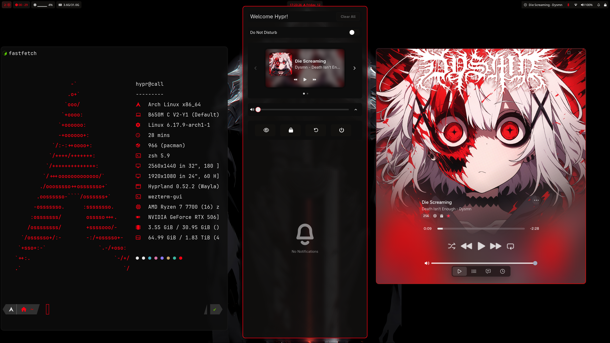
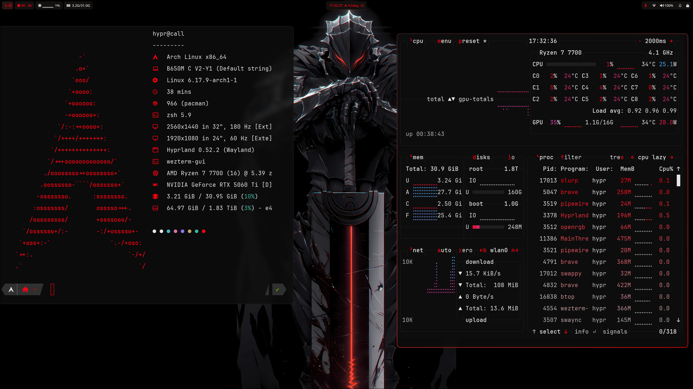

# My Arch Linux Dotfiles

> **Established:** November 2025  
> **Theme:** Code Red / HyprCall

## 👋 Introduction

Welcome to my personal configuration repository! 

This is my **first attempt** at creating and managing a dotfiles repo. I started my journey with Arch Linux in **November 2025**, diving headfirst into the ecosystem. 

## 🧪 The "Frankenstein" Build

I'll be honest—this configuration is a bit of a Frankenstein build. 

I have stitched together code, stylesheets, and scripts from countless other repositories, forums, and documentation pages. There are too many sources to name individually, but I've learned a massive amount by dissecting other people's work, editing it to fit my needs, and writing my own glue code where necessary.

If you recognize something here, credit likely belongs to the community at large!

## 📸 Gallery

Here is what the current setup looks like:


*Main Desktop Workflow*


*System Info*

## 🎨 Aesthetic & Palette

The setup follows a **"Code Red"** aesthetic, featuring deep blacks/greys with a sharp **Red (#ff0012)** primary accent.

| Element | Color | Hex |
| :--- | :--- | :--- |
| **Primary Accent** | Red | `#ff0012` |
| **Secondary Accent** | Sky Blue | `#49b1f5` |
| **Background** | Deep Black | `#0d0d0d` |

## 🛠️ Software Stack

I manage these dotfiles using **GNU Stow**.

- **OS:** Arch Linux
- **WM:** Hyprland
- **Bar:** Waybar
- **Terminal:** WezTerm
- **Shell:** Zsh
- **Launcher:** Rofi
- **System Info:** Fastfetch, Btop
- **Notifications** SwayNC
- **Music** Cider
- **Editor** NeoVim
- **Display Manager** SDDM
- **TUI File Manager** Yazi

## 🚀 Installation

Since I use GNU Stow, installation looks something like this:

```bash
git clone https://github.com/YOUR_USERNAME/dotfiles.git
cd dotfiles
stow hypr
stow waybar
stow rofi
# ... and so on
```
