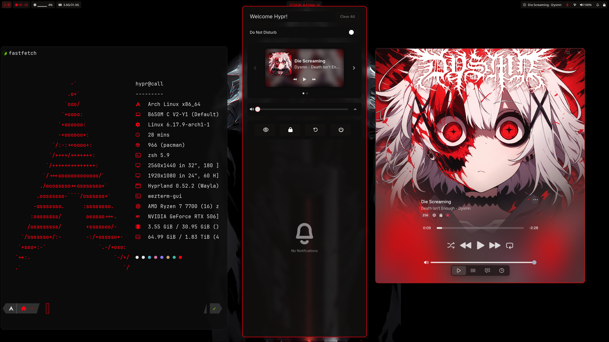
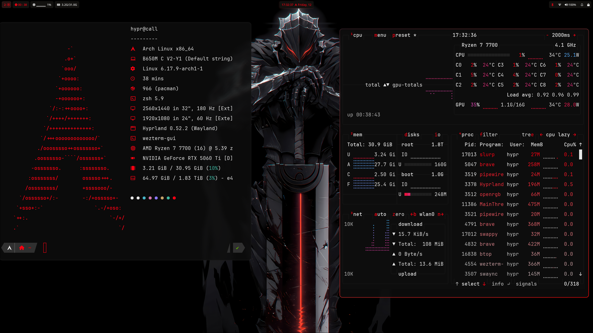

# My Arch Linux Dotfiles

> **Established:** November 2025  
> **Theme:** Code Red

## 👋 Introduction

Welcome to my personal configuration repository! 

This is my **first attempt** at creating and managing a dotfiles repo. I started my journey with Arch Linux in **November 2025**, diving headfirst into the ecosystem. As a university student, keeping this repository updated is a significant and ongoing project for me.

## 🧪 The "Frankenstein" Build

I will be honest, this configuration is a bit of a Frankenstein build. 

I have stitched together code, stylesheets, and scripts from countless other repositories, forums, and documentation pages. There are too many sources to name individually, but I have learned a massive amount by dissecting other people's work, editing it to fit my needs, and writing my own glue code where necessary.

If you recognize something here, credit likely belongs to the community at large!

## 📸 Gallery

Here is what the current setup looks like:


*Main Desktop Workflow*


*System Info*

## 🎨 Aesthetic & Palette

The setup follows a **"Code Red"** aesthetic, featuring deep blacks and greys with a sharp **Red (#ff0012)** primary accent. The active window border uses a sleek gradient from dark Burgundy to vivid Red. A **Sky Blue (#49b1f5)** acts as a secondary accent, primarily used for text selections and hover states.

| Element | Color | Hex |
| :--- | :--- | :--- |
| **Primary Accent** | Red | `#ff0012` |
| **Secondary Accent** | Sky Blue | `#49b1f5` |
| **Active Border Gradient** | Burgundy to Red | `#3c1d25` to `#ff0000` |
| **Background Base** | Deep Black | `#0d0d0d` |
| **Surface Grey** | Surface Grey | `#12110F` |

## 🛠️ Software Stack

I manage these dotfiles using **GNU Stow**.

- **OS:** Arch Linux
- **WM:** Hyprland
- **Bar:** Waybar
- **Terminal:** WezTerm
- **Shell:** Zsh
- **Launcher / Menus:** Rofi
- **System Info:** Fastfetch, Btop
- **File Managers:** Yazi, Lsd
- **Notifications:** SwayNC
- **Music:** Cider
- **Editor:** Neovim
- **Display Manager:** SDDM
- **Extras:** Custom Rofi Recorder, Hyprland Preview Share Picker

## 🚀 Installation

Since I use GNU Stow, installation looks something like this:

```bash
git clone https://github.com/YOUR_USERNAME/dotfiles.git
cd dotfiles
stow hypr
stow waybar
stow rofi
# ... and so on
```
